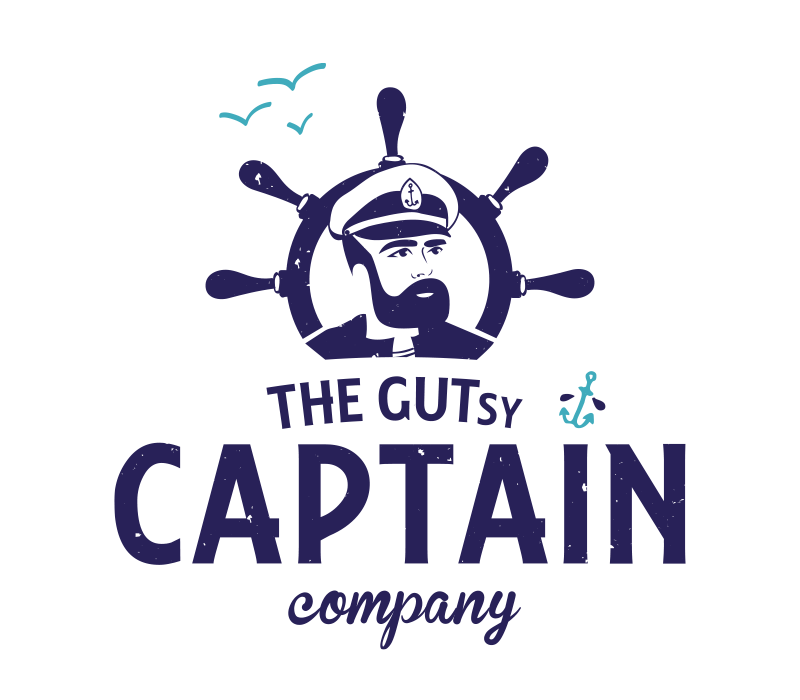

# SurfWeb – Developer Documentation

## Table of Contents

1. [Project Overview](#1-project-overview)
2. [File Structure](#2-file-structure)
3. [Design System](#3-design-system)
   - [Colors](#31-colors)
   - [Typography](#32-typography)
   - [Fonts](#33-fonts)
   - [Spacing & Layout](#34-spacing--layout)
4. [Architecture: How the Page Works](#4-architecture-how-the-page-works)
   - [Head & Dependencies](#41-head--dependencies)
   - [HTML Sections](#42-html-sections)
   - [CSS Conventions](#43-css-conventions)
   - [JavaScript Features](#44-javascript-features)
5. [Extending the Site](#5-extending-the-site)
   - [Header (Navigation)](#51-header-navigation)
   - [Adding New Sections to the Homepage](#52-adding-new-sections-to-the-homepage)
   - [Adding New Pages](#53-adding-new-pages)
   - [Adding a Gallery Page](#54-adding-a-gallery-page)
   - [Adding a Blog](#55-adding-a-blog)
6. [Content Guide](#6-content-guide)
   - [Images & Assets](#61-images--assets)
   - [Bilingual Content (Czech / English)](#62-bilingual-content-czech--english)
   - [Translation Files](#63-translation-files)
   - [Hero Background Video](#64-hero-background-video)
   - [Video Modal](#65-video-modal)
   - [Photo Carousels](#66-photo-carousels)
   - [Sponsor Logos](#67-sponsor-logos)
7. [Reusable Components](#7-reusable-components)
8. [Deployment](#8-deployment)
9. [External Links Reference](#9-external-links-reference)

---

## 1. Project Overview

**SurfWeb** is a static, single-file sponsorship and portfolio website for Jan Vítek — a Czech surfer competing internationally. It is built with:

- **HTML** — single `index.html` entry point
- **Tailwind CSS** — loaded via CDN, no build step needed
- **Vanilla JavaScript** — no libraries or frameworks
- **Adobe Fonts (Typekit)** — RealistWide (headings) + Realist (body)

The site opens directly in any browser. There is no Node.js, npm, or build process. To run it, just open `index.html`.

---

## 2. File Structure

```
SurfWeb/
├── index.html              ← Main (and currently only) page
├── DOCS.md                 ← This file
├── Assets/                 ← All images used on the site
│   ├── Video/
│   │   ├── hero surf jan vitek.mp4  (hero looping background video, H.264, 720p, ~1.1 MB)
│   │   └── results.mp4              (results video, H.264 + AAC, 720×1280 portrait, ~4.7 MB — loads on click only)
│   ├── Logos/
│   │   ├── captain-kombucha.png     (Captain Kombucha — oficiální partner)
│   │   └── jdidohor.png             (Jdi do hor — oficiální partner)
│   ├── Jan Vitek Face.jpg           (Jan's portrait — About section)
│   ├── Logos Partners Jan Vitek.jpg (surfboard with "your logo here" spots — Sponsorship)
│   ├── Nahled Champion...jpg        (results video thumbnail — podium photo, ~170 KB)
│   ├── Top Turn Jan Vitek.jpg       (carousel 1 + hero video poster/fallback)
│   ├── Fitnes JV.jpg                (carousel 1)
│   ├── Backside Turn Jan Vitek.jpg  (carousel 1)
│   ├── 2nd place feeling...jpg      (carousel 1)
│   ├── Solid Turn Jan Vitek.jpg     (carousel 1)
│   ├── Victory Feeling...jpg        (carousel 1)
│   ├── Jan Surf Reentry.jpg         (carousel 1)
│   ├── Surf Morocco Jan Vitek.jpg   (carousel 2)
│   ├── Kombucha Jan Vitek.jpeg      (carousel 2)
│   ├── Wetsuit Jan Vitek.jpg        (carousel 2)
│   ├── Cheeky Jan Vitek.JPG         (carousel 2)
│   ├── Car Jan Vitek.jpg            (carousel 2)
│   ├── Speedoes Jan Vitek.jpg       (carousel 2)
│   └── Surfr Jan Vitek.jpg          (carousel 2)
├── resources/
│   ├── cs.js               ← Czech translations (editable)
│   ├── en.js               ← English translations (editable)
│   ├── symboly.svg         (three-circle "humans" logo, used inline in marquees)
│   ├── index.html          (Figma export — reference only)
│   ├── Desktop.jpg         (desktop mockup)
│   ├── Mobile.jpg          (mobile mockup)
│   ├── fontSIzes.jpg       (typography reference)
│   └── urls.txt            (link inventory)
```

**Rules:**
- Put all images in `Assets/`.
- Add new HTML pages (blog, gallery, etc.) at the root level, alongside `index.html`.
- Edit `resources/cs.js` and `resources/en.js` to update text content.

---

## 3. Design System

### 3.1 Colors

| Role             | Value       | Usage                            |
|------------------|-------------|----------------------------------|
| Background       | `#f0f1ea`   | Page background (cream/off-white)|
| Text / Dark      | `#0c1313`   | All body text and headings       |
| Accent / Red     | `#ff4448`   | Marquee bars, CTA button, links, play icons |
| White            | `#ffffff`   | Sponsor logos footer section     |

Apply colors inline with Tailwind:
```html
bg-[#ff4448]   text-[#0c1313]   bg-[#f0f1ea]
```

### 3.2 Typography

Font sizes use **CSS `clamp()`** for fluid scaling — they grow proportionally between 390px (mobile) and 1440px (desktop) with no abrupt jumps at any breakpoint.

| Class          | Mobile (390px) | Desktop (1440px) | Line-height | Use for               |
|----------------|---------------|-----------------|-------------|----------------------|
| `h1-display`   | 48px          | 120px           | 1.0         | Hero headline         |
| `h1`           | 40px          | 80px            | 1.4         | Section large titles  |
| `h2`           | 34px          | 60px            | 1.3         | Section headings      |
| `h3`           | 28px          | 42px            | 1.3         | Sub-section headings  |
| `body`         | 18px          | 22px            | 1.8         | All body text         |
| `nav`          | 14.4px        | 22px            | 1.0         | Header / navigation   |
| `link`         | 18px (fixed)  | 18px (fixed)    | 1.0         | Standalone link URLs  |
| `menu`         | 24px (fixed)  | 24px (fixed)    | 1.0         | Reserved              |

**Usage — one class, no breakpoint override needed:**
```html
<p class="text-body font-semibold"> ... </p>
<h2 class="text-h2 font-semibold font-heading"> ... </h2>
<h1 class="text-h1-display font-semibold font-heading"> ... </h1>
```

**How the clamp formula works:**
```
font-size: clamp(mobile-size, m*vw + b, desktop-size)
```
The intermediate value interpolates linearly across the 390–1440px viewport range. To adjust a size, change the min and max values in the Tailwind config — the slope recalculates automatically if you use:
```
m = (desktop - mobile) / (1440 - 390)  [expressed as vw]
b = mobile - m * 390                    [px intercept]
```

### 3.3 Fonts

Fonts are loaded from **Adobe Fonts (Typekit)** via `https://use.typekit.net/xjh6vlt.css`.

| Font          | Family name    | Tailwind class   | Weight | Usage                         |
|---------------|---------------|-----------------|--------|-------------------------------|
| RealistWide   | `"realistwide"` | `font-heading`  | 600    | All headings (h1-display, h1, h2, h3) |
| Realist       | `"realist"`     | `font-body`     | 600    | Body text, links, UI elements |

**How it works:**
- Fonts are defined in `tailwind.config.theme.extend.fontFamily`
- `<body>` has `class="font-body"` — all text inherits Realist
- Heading elements get `class="font-heading"` — overrides to RealistWide
- Font weight is **Semibold (600)** everywhere — applied via `font-semibold`

**Rule: every element with `text-h1-display`, `text-h1`, `text-h2`, or `text-h3` must also have `font-heading`.**

```html
<!-- Correct -->
<h2 class="text-h3 font-semibold font-heading">heading text</h2>
<p class="text-h1 font-semibold font-heading">large display text</p>

<!-- Body text — no font-heading needed -->
<p class="text-body font-semibold">body text</p>
```

**To change Adobe fonts:**
1. Replace the Typekit link in `<head>` with your kit: `https://use.typekit.net/YOUR_KIT_ID.css`
2. Update `fontFamily` in the Tailwind config with new family names

### 3.4 Spacing & Layout

- Page horizontal padding: `px-6 lg:px-[168px]`
- Section vertical padding: `py-20 lg:py-[260px]` (large sections), `py-10 lg:py-[60px]` (small)
- Two-column desktop layout: `flex flex-col lg:flex-row`, each column `lg:w-1/2`
- Content gaps: `gap-10 lg:gap-[60px]`

---

## 4. Architecture: How the Page Works

### 4.1 Head & Dependencies

```html
<!-- Tailwind CSS (CDN — no install needed) -->
<script src="https://cdn.tailwindcss.com"></script>

<!-- Adobe Fonts (Typekit) — RealistWide + Realist, weight 600 -->
<link rel="stylesheet" href="https://use.typekit.net/xjh6vlt.css" />

<!-- Translations (loaded as global variables — works with file://) -->
<script src="resources/cs.js"></script>
<script src="resources/en.js"></script>

<!-- Tailwind custom config (font sizes + font families) -->
<script>
  tailwind.config = {
    theme: {
      extend: {
        fontSize: { /* clamp() values — see section 3.2 */ },
        fontFamily: {
          'body':    ['"realist"', 'sans-serif'],
          'heading': ['"realistwide"', 'sans-serif'],
        }
      }
    }
  }
</script>

<!-- Custom CSS (animations, modal, lang toggle) -->
<style>
  body { font-family: "realist", sans-serif; }
  /* ... animations, modal, accent-link, etc. ... */
</style>
```

To add a **new Tailwind custom color or spacing**, extend the config block:
```js
tailwind.config = {
  theme: {
    extend: {
      fontSize: { /* existing */ },
      fontFamily: { /* existing */ },
      colors: {
        'brand-red': '#ff4448',
        'brand-dark': '#0c1313',
      }
    }
  }
}
```

### 4.2 HTML Sections

The page starts with a fixed `<header>` (overlays the hero), followed by sections labeled A through O. Note: Photo Carousel 2 (J) appears before Stats (I2) in the HTML:

| ID   | Section                | Anchor     |
|------|------------------------|------------|
| —    | **Header (fixed)**     | —          |
| B    | Hero (looping video)   | —          |
| A    | Red Marquee (top)      | —          |
| C    | About (Who is Jan?)    | —         |
| D    | Why I do this          | —         |
| E    | Results                | —         |
| F    | Photo Carousel 1       | —         |
| G    | Plan 2026              | `#plan`   |
| H    | Sponsorship            | —         |
| I    | Collaboration Text     | —         |
| I3   | Partner Benefits (dropdown) | —    |
| J    | Photo Carousel 2       | —         |
| I2   | Sponsor Stats (reach)  | `#stats`  |
| K    | Contact CTA            | `#contact` |
| L2   | Buy Me a Wave (donations) | —      |
| L    | Social Links           | —         |
| M    | Media / Press          | —         |
| N    | Sponsor Logos          | —         |
| O    | Red Marquee (footer)   | —         |

**To link to a section**, add `id="section-name"` to the `<section>` tag and link with `href="#section-name"`.

### 4.3 CSS Conventions

Custom CSS lives in the `<style>` block in `<head>`. It covers only non-Tailwind things:

- `body` — base font-family fallback
- `.marquee-track` — infinite horizontal scroll animation; text uses RealistWide Medium (`font-heading font-medium`); words separated by inline SVG three-circle symbols from `resources/symboly.svg`
- `.carousel-track` — auto-scrolling photo strip (pauses on drag via `.dragging` class)
- `.modal-backdrop` / `.modal-backdrop.active` — video overlay
- `a.accent-link` — underline in font color (`#0c1313`), fades on hover
- `.play-btn` — scale-up hover for video play icons
- `.lang-btn` / `.lang-btn.active` — header language toggle buttons (active = full opacity, inactive = 0.4)
- `.partner-arrow` / `.partner-open .partner-arrow` — dropdown chevron with 180° rotation on open
- `.partner-content` — collapsible container with `max-height` transition (JS-controlled)

**Fonts are NOT set in CSS.** They are controlled by Tailwind classes `font-body` and `font-heading`.

### 4.4 JavaScript Features

All JS is in a single `<script>` block at the bottom of `<body>`.

**Translation loader**
```js
// Uses global variables TRANSLATIONS_CS and TRANSLATIONS_EN (loaded via <script> tags)
// Updates data-cs/data-en attributes from JS values
// Works with both file:// and HTTP — no server needed
```

**Language toggle (header buttons)**
```js
// Two .lang-btn buttons in the header (cz / en)
// Clicking one sets currentLang to its data-lang value
// Updates all [data-cs][data-en] elements and toggles .active class
```

**Copy to clipboard (email)**
```js
// Clicking the red email box (#copyEmail) copies the email address
// No separate copy icon — the entire box is clickable
navigator.clipboard.writeText('wonderwayofj@gmail.com')
// Shows #copyFeedback for 2 seconds
```

**Video modal**
```js
// Any element with class .video-trigger opens the modal
// data-video attribute can be used to load different videos
// ESC key and backdrop click close the modal
```

**Scroll to email (centered)**
```js
// Both .scroll-to-email links and a[href="#contact"] (nav) scroll to #copyEmail
// Element is centered vertically in the viewport
// Uses window.scrollTo with behavior: 'smooth'
```

**Krátce / Příběh tab switcher (About section)**
```js
// Two .who-tab buttons switch between #who-tab-kratce and #who-tab-pribeh panels
// Active tab: underline class + no opacity. Inactive: opacity-40
// Content is bilingual — stored in cs.js / en.js under keys who_tab_kratce / who_tab_pribeh
// HTML content (paragraphs, links) inserted via innerHTML by the translation loader
```

**Partner dropdown toggle**
```js
// Clicking #partnerDropdown toggles #partnerContent visibility
// Uses JS-set style.maxHeight (overrides Tailwind CDN specificity)
// CSS class .partner-open on wrapper rotates the chevron arrow 180°
// Chevron is an SVG with sharp corners (stroke-linecap="square", stroke-linejoin="miter")
```

**Carousel auto-scroll + drag/swipe**
```js
// Each .carousel-section has native overflow-x: scroll + requestAnimationFrame auto-scroll
// speed = 0.4 px/frame (gentle drift)
// paused = true on mousedown/touchstart; resumes 800ms after release
// Mouse drag: tracks pageX delta, multiplies by 1.5 for responsiveness
// Touch: native browser scroll handles momentum; auto-scroll pauses during touch
// Images are duplicated in HTML for seamless loop — JS resets scrollLeft at halfway point
// pointer-events: none on images prevents browser drag-ghost
```

---

## 5. Extending the Site

### 5.1 Header (Navigation)

The site has a fixed transparent header overlaying the hero, with fluid typography (`text-nav`). Structure:

```
Left:   "wonderway of j" [humans symbol SVG] "jan vítek"
Right:  "→ kontakt"        ← top line on mobile
        "cz | en"          ← second line on mobile (stacked below)
```

- **Position:** `fixed top-0 left-0 z-50` — overlays the hero section, transparent background
- **Font:** RealistWide Medium (`font-heading font-medium text-nav`)
- **Symbol:** inline SVG (three circles / humans logo), height scales with `clamp(15.6px, 0.99vw + 11.7px, 26px)`
- **Padding:** `px-4 lg:px-6` (16px mobile, 24px desktop)
- **Logo alignment:** `items-start lg:items-center` — top-aligned on mobile (so logo doesn't center between stacked nav lines)
- **Right nav (mobile):** `flex-col-reverse` stacks "cz | en" below "→ kontakt" with `gap-3` for easy tapping
- **Right nav (desktop):** `flex-row items-center gap-16` — single horizontal line
- **Language toggle:** two `<button class="lang-btn">` elements; active one gets `.active` class
- **Contact link:** scrolls to `#contact` section, text is translatable (`nav_contact` key)

### 5.2 Adding New Sections to the Homepage

Copy this minimal section template:

```html
<!-- NEW SECTION -->
<section id="my-section" class="px-6 lg:px-[168px] py-20 lg:py-[260px]">
  <div class="flex flex-col gap-10 lg:gap-[60px]">
    <h2 class="text-h2 font-semibold font-heading">
      <span data-key="my_key" data-cs="český nadpis" data-en="english heading">český nadpis</span>
    </h2>
    <p class="text-body font-semibold">
      <span data-key="my_body" data-cs="obsah v češtině" data-en="content in english">obsah v češtině</span>
    </p>
  </div>
</section>
```

Always:
- Add `font-heading` to heading-sized elements
- Provide both `data-cs` and `data-en` on translatable text
- Add `data-key` and update both JS translation files (`resources/cs.js`, `resources/en.js`)

### 5.3 Adding New Pages

New pages are `.html` files at the project root. Each page should share the same `<head>` boilerplate:

```html
<!DOCTYPE html>
<html lang="cs">
<head>
  <meta charset="UTF-8" />
  <meta name="viewport" content="width=device-width, initial-scale=1.0" />
  <title>Jan Vítek – Page Title</title>
  <script src="https://cdn.tailwindcss.com"></script>
  <link rel="stylesheet" href="https://use.typekit.net/xjh6vlt.css" />
  <script>
    tailwind.config = {
      theme: {
        extend: {
          fontSize: {
            'h1-display': ['clamp(48px, 6.86vw + 21px, 120px)', { lineHeight: '1' }],
            'h1':         ['clamp(40px, 3.81vw + 25px, 80px)',  { lineHeight: '1.4' }],
            'h2':         ['clamp(34px, 2.48vw + 24px, 60px)',  { lineHeight: '1.3' }],
            'h3':         ['clamp(28px, 1.33vw + 23px, 42px)',  { lineHeight: '1.3' }],
            'body':       ['clamp(18px, 0.38vw + 16.5px, 22px)', { lineHeight: '1.8' }],
            'link':       ['18px', { lineHeight: '1' }],
            'menu':       ['24px', { lineHeight: '1' }],
            'nav':        ['clamp(14.4px, 0.72vw + 11.6px, 22px)', { lineHeight: '1' }],
          },
          fontFamily: {
            'body':    ['"realist"', 'sans-serif'],
            'heading': ['"realistwide"', 'sans-serif'],
          }
        }
      }
    }
  </script>
  <style>
    body { font-family: "realist", sans-serif; }
    html { scroll-behavior: smooth; }
    body { background: #f0f1ea; color: #0c1313; }
    a.accent-link {
      text-decoration: underline;
      text-decoration-color: #0c1313;
      text-underline-offset: 4px;
    }
    a.accent-link:hover { opacity: 0.7; }
  </style>
</head>
<body class="overflow-x-hidden font-body">
  <main class="px-6 lg:px-[168px] py-20 lg:py-[160px]">
    <h1 class="text-h1 font-semibold font-heading mb-10">Page Title</h1>
    <!-- content -->
  </main>
</body>
</html>
```

### 5.4 Adding a Gallery Page

Create `gallery.html` using the page template above, then add a masonry grid inside `<main>`. See resources for full gallery + lightbox code.

### 5.5 Adding a Blog

Create `blog.html` for post listing and `blog/*.html` for individual posts. Each post uses the same `<head>` boilerplate.

```
SurfWeb/
├── index.html
├── blog.html              ← post listing
└── blog/
    ├── berber-cup-2026.html
    └── ...
```

---

## 6. Content Guide

### 6.1 Images & Assets

- Store all images in `Assets/`, logos in `Assets/Logos/`
- Use `.jpeg` for photos, `.png` for logos/transparency
- **Compress images** before adding: [Squoosh](https://squoosh.app/) for photos, `sips` for quick macOS compression
- **Compress videos** with ffmpeg: `ffmpeg -i input.mp4 -vcodec libx264 -crf 32 -preset slow -vf "scale=-2:720" -movflags +faststart -an output.mp4`
- Ideal carousel image dimensions: any width, 720px tall
- All carousel images use `loading="lazy"` — only load when scrolled into view
- Add `loading="lazy"` to any new non-hero images

**Performance budget (current state):**
| Asset | Size |
|---|---|
| hero video | ~1.1 MB |
| teaser video | ~12 MB (loads on click only) |
| results video | ~4.7 MB (loads on click only) |
| carousel images (14 unique) | ~2.5 MB total (lazy loaded) |
| thumbnails + logos + QR | ~400 KB |

### 6.2 Bilingual Content (Czech / English)

Every translatable text element uses two data attributes:

```html
<span data-key="unique_key" data-cs="český text" data-en="english text">český text</span>
```

Rules:
- The visible text between the tags is the **default (Czech)** displayed on load
- Both `data-cs` and `data-en` must always be present
- `data-key` links the element to the JSON translation files
- HTML markup (links, `<br>`, etc.) is allowed inside attribute values — inserted with `innerHTML`
- The language toggle reads `EN` (currently Czech) / `CZ` (currently English)

### 6.3 Translation Files

Text content can be edited via JS files without touching HTML:

- `resources/cs.js` — all Czech text (variable `TRANSLATIONS_CS`)
- `resources/en.js` — all English text (variable `TRANSLATIONS_EN`)

**How to update text:**
1. Open `resources/cs.js` or `resources/en.js`
2. Find the key (e.g. `"hero_headline"`)
3. Change the value
4. Save — the site loads updated text on next page load

**Important:** Do not change the first line (`var TRANSLATIONS_CS = {`) or the last line (`};`). Only edit the values between quotes.

**Keys are organized by section:**
- `hero_*` — Hero section
- `who_*` — About section
- `why_*` — Why section
- `results_*`, `result_*`, `goal_*` — Results section
- `plan_*` — Plan section
- `sponsor_*` — Sponsorship section
- `collab_*` — Collaboration section
- `partner_*` — Partner benefits dropdown section
- `stats_*` — Sponsor stats / reach & audience section
- `contact_*`, `copy_*` — Contact section
- `social_*` — Social links section
- `nav_*` — Header / navigation

**Works everywhere** — no HTTP server needed. Files load via `<script>` tags, so they work with `file://` protocol too.

### 6.4 Hero Background Video

The hero section uses a looping background video instead of a static image:

```html
<video class="absolute inset-0 w-full h-full object-cover"
       autoplay muted loop playsinline
       poster="Assets/Top Turn Jan Vitek.jpg">
  <source src="Assets/Video/hero surf jan vitek.mp4" type="video/mp4">
  
</video>
```

**Key attributes:**
- `autoplay muted` — required pair for autoplay in all browsers
- `loop` — seamless looping
- `playsinline` — prevents fullscreen on iOS
- `poster` — shown while video loads (`Top Turn Jan Vitek.jpg`, ~120 KB)
- `` fallback — shown in browsers without video support

**Current file:** `hero surf jan vitek.mp4` — 720p, H.264, no audio, ~1.1 MB (compressed with ffmpeg CRF 35)

**To replace the video:**
1. Compress to H.264 MP4, no audio, target ≤ 2 MB
2. Use: `ffmpeg -i input.mov -vcodec libx264 -crf 32 -preset slow -vf "scale=-2:720" -movflags +faststart -an output.mp4`
3. Keep `poster` pointing to a representative frame as JPEG fallback

### 6.5 Video Modal

The modal supports two modes configured via data attributes on `.video-trigger` elements:

| Attribute           | Values                    | Default     |
|---------------------|---------------------------|-------------|
| `data-video-url`    | URL to video/embed        | YouTube placeholder |
| `data-video-type`   | `native` or `iframe`      | `iframe`    |
| `data-video-aspect` | `portrait` or `landscape` | `landscape` |

**Native video** (self-hosted MP4): uses HTML5 `<video>` with controls and playsinline.
**Iframe** (YouTube etc.): uses `<iframe>` with autoplay parameter.

Portrait mode sets the modal to 9:16 aspect ratio (max 420px wide, max 85vh tall).

**Current videos:**
- **Teaser** — `Assets/Video/wonderway-of-j-teaser.mp4` (12 MB, 720p, landscape, loads on click)
- **Results** — `Assets/Video/results.mp4` (4.7 MB, portrait, loads on click)

Example:
```html
<div class="video-trigger" data-video-url="Assets/Video/wonderway-of-j-teaser.mp4" data-video-type="native" data-video-aspect="landscape">
```

### 6.6 Photo Carousels

Each carousel uses **native `overflow-x: scroll`** with `requestAnimationFrame` auto-scroll. Images are **doubled** in the HTML for seamless looping — when `scrollLeft` reaches the halfway point, JS resets it to 0 (invisible because both halves are identical).

**To add a photo:**
1. Put image in `Assets/`
2. Add `` tag in **both** the original and duplicate halves of the track (before and after `<!-- Duplicates for seamless loop -->`)

**To change scroll speed:** adjust `speed` in the carousel JS (default `0.4` px/frame). Lower = slower.

**To disable auto-scroll on one carousel:** remove its `id` from `carouselSection1` / `carouselSection2`, or set `speed = 0`.

**Interaction:** mouse drag and touch swipe both work natively. Auto-scroll pauses during interaction and resumes 800ms after release.

### 6.7 Buy Me a Wave (Donations)

Section L2 allows visitors to support Jan with micro-donations via [buymeacoffee.com/wonderwayofj](https://buymeacoffee.com/wonderwayofj).

- QR code image: `Assets/qr-code.png` with `mix-blend-multiply` (blends white background with cream page)
- Bilingual title + description (keys: `bmaw_title`, `bmaw_desc`)
- Positioned before Social Links section

### 6.8 Sponsor Logos

The footer sponsor section (Section N) is split into **three tiers**:

| Tier | Czech | English | Layout |
|------|-------|---------|--------|
| Hlavní partneři | hlavní partneři | main partners | Left column — large logos |
| Oficiální partneři | oficiální partneři | official partners | Right column top — medium logos |
| Mediální partneři | mediální partneři | media partners | Right column bottom — small logos |

**Current official partners:**
- **Captain Kombucha** — `Assets/Logos/captain-kombucha.png` → links to `https://www.gutsycaptain.cz/`
- **Jdi do hor** — `Assets/Logos/jdidohor.png` → links to `https://www.jdidohor.cz/home`

**To add a logo:** place file in `Assets/Logos/` and add an `` inside the appropriate tier section.
Wrap in `<a href="..." target="_blank" class="hover:opacity-70 transition-opacity">` for a clickable link.

**Logo sizes by tier:**
- Hlavní: `class="w-40 lg:w-56 h-20 object-contain"`
- Oficiální: `class="h-16 w-auto object-contain"`
- Mediální: `class="w-12 lg:w-20 h-8 object-contain"`

**Desktop/mobile alignment:**
- Desktop: headings + logos left-aligned (`items-start`, `justify-start`)
- Mobile: headings + logos centered (`items-center`, `justify-center`)

**Partner logos also appear in the hero section** (bottom-left corner, absolute position):
```html
<div class="absolute bottom-8 left-6 lg:left-[168px] flex items-center gap-12 z-20">
  <a href="..."></a>
  <a href="..."></a>
</div>
```

---

## 7. Reusable Components

### Red CTA Button
```html
<a href="mailto:wonderwayofj@gmail.com"
   class="inline-block bg-[#ff4448] px-8 py-4 text-h3 font-medium font-heading text-[#0c1313] hover:opacity-90 transition-opacity">
  → text here
</a>
```
Note: CTA buttons ("mrkni na plán", "pusť si teaser") use **RealistWide Medium** (`font-medium font-heading`).

### Accent Link (underline in font color)
```html
<a href="https://example.com" target="_blank" class="accent-link">link text</a>
```

### Heading (any size)
```html
<!-- Always pair text-h* with font-heading -->
<h2 class="text-h2 font-semibold font-heading">heading</h2>
<p class="text-h1 font-semibold font-heading">large display text in a paragraph</p>
```

### Two-Column Section
```html
<section class="px-6 lg:px-[168px] py-20 lg:py-[260px]">
  <div class="flex flex-col lg:flex-row gap-12">
    <div class="lg:w-1/2"><!-- Left --></div>
    <div class="lg:w-1/2"><!-- Right --></div>
  </div>
</section>
```

---

## 8. Deployment

### Hosting: Netlify (free)

The site is deployed at **[wonderwayofj.com](https://wonderwayofj.com)** via Netlify connected to GitHub.

**Automatic deploys:** every `git push` to `main` → Netlify builds and deploys within ~30 seconds.

**Setup:**
- GitHub repo: `wonderwayofj/surfweb`
- Netlify site: connected to the repo, no build command, publish directory `.`
- Domain: `wonderwayofj.com` registered at [Active24.cz](https://active24.cz)
- DNS: `A` records at Active24 pointing to Netlify's load balancer
- SSL: automatic via Let's Encrypt (free)

**To update the live site:**
```bash
git add .
git commit -m "description of change"
git push
```

### Local development

Open `index.html` directly in any browser — no server needed.
Or run a simple server: `python3 -m http.server 8000` → `http://localhost:8000`

---

## 9. External Links Reference

| Label                   | URL                                                                 |
|-------------------------|---------------------------------------------------------------------|
| Designer portfolio      | https://humanscollective.com/                                       |
| Creator / Linktree      | https://linktr.ee/janvitek                                          |
| Instagram               | https://www.instagram.com/wonderwayofj/                             |
| ISA World Surfing Games | https://isasurf.org/                                                |
| Surfchamp               | https://www.surfchamp.cz/                                           |
| PSK Wavepool Munich     | https://www.prazskejserf.cz/serfovej-open                          |
| Elite Lisbon (modelling)| https://www.elitelisbon.com/en/jan-vitek/                           |
| Media article 1         | https://zdarsky.denik.cz/volny-cas/neuveritelny-pribeh-kluk-svratka-zdarsko-surfing-cesko-slovensky-pohar-cestovani.html |
| Media article 2         | https://zdarsky.denik.cz/ostatni_region/jan-vitek-svratka-surfing-cesko-slovensky-pohar-druhe-misto-celkove-vedeni.html |
| Media article 3         | https://www.czech.surf/post/berber-cup-posouva-hranice-cesko-slovenskeho-surfingu |
| Contact email           | wonderwayofj@gmail.com                                              |
